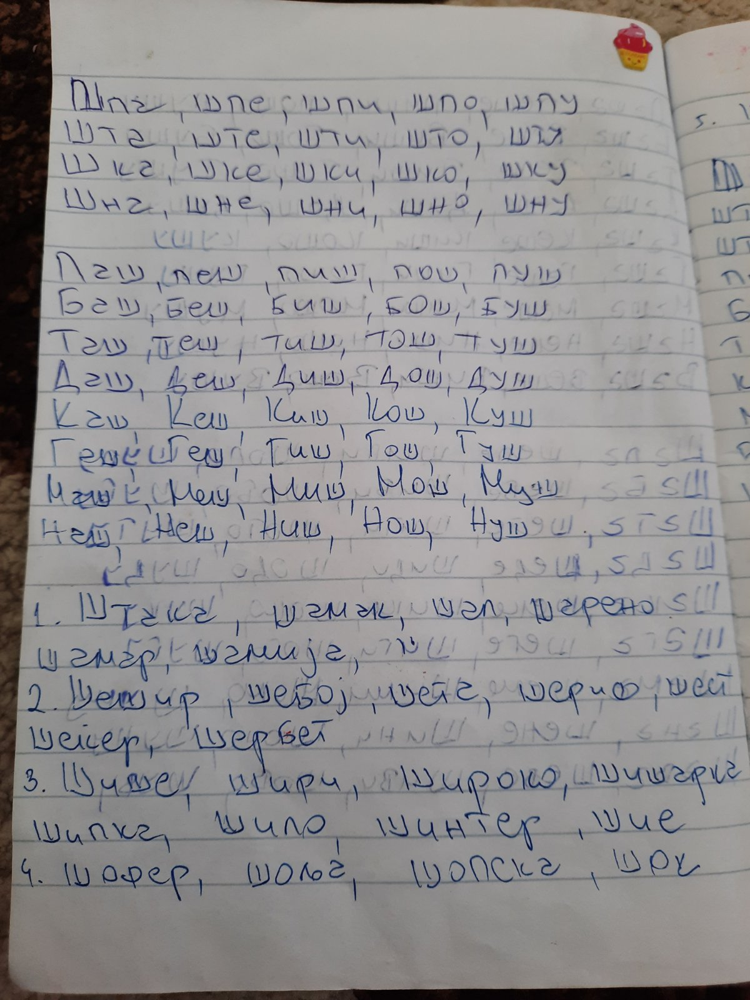

# Speech Therapist
Speech therapy assesses and treats speech disorders and communication problems.

## Give a Star! :star:

If you like or are using this project to learn, please give it a star. Thanks!!!

## Table of Contents

- [1. Орална Праксија](#1-орална-праксија)
- [2. Ш](#2-ш)
  - [2.1 ш](#21-ш)
  - [2.2 ш](#22-ш)
  - [2.3 ш](#23-ш)
  - [2.4 ш](#24-ш)
  - [2.5 ш](#25-ш)
  - [2.6 ш](#26-ш)
- [3. Ж](#3-ж)
  - [3.1 ж](#31-ж)
  - [3.2 ж](#32-ж)
  - [3.3 ж](#33-ж)
  - [3.4 ж](#34-ж)
  - [3.5 ж](#35-ж)
- [4. Ч](#4-ч)
  - [4.1 ч](#41-ч)
  - [4.2 ч](#42-ч)
  - [4.3 ч](#43-ч)
  - [4.4 ч](#44-ч)
  - [4.5 ч](#45-ч)
  - [4.6 ч](#46-ч)

## 1. Орална Праксија
- Гимнастика на јазик и образи
  - Јазикот го плазиме надвор
  - Јазикот го креваме према нос и надолу према брада
  - Јазикот е надвор и правиме кружни движења (како оближување)
  - Ги дуваме образите
  - Со затворени заби буткаме со јазикот
  - Од насмевка во бакнеж 
  - Имитираме џвакање
  - Силно отвораме уста
  - Вежбите ги правиме секој ден со најмалку 5 повторувања
- 

## 2. Ш
### 2.1 ш

### 2.2 ш

### 2.3 ш

### 2.4 ш

### 2.5 ш

### 2.6 ш

## 3. Ж
### 3.1 ж

### 3.2 ж

### 3.3 ж

### 3.4 ж

### 3.5 ж

## 4. Ч
### 4.1 ч

### 4.2 ч

### 4.3 ч

### 4.4 ч

### 4.5 ч

### 4.6 ч

