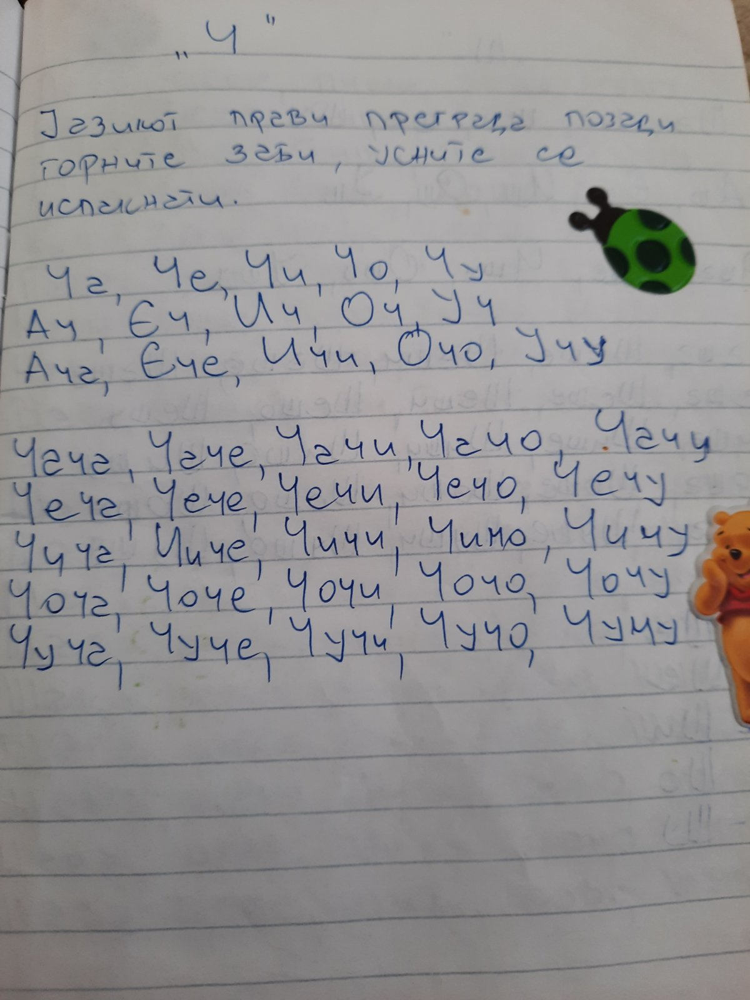

# Speech Therapist
Speech therapy assesses and treats speech disorders and communication problems.

## Give a Star! :star:

If you like or are using this project to learn, please give it a star. Thanks!!!

## Table of Contents

[1. Орална Праксија](#1-орална-праксија)

[2. Ш](#2-ш)

[3. Ж](#3-ж)

[4. Ч](#4-ч)

&nbsp;&nbsp;[1.1 Docker](#11-docker)

&nbsp;&nbsp;[1.2 Visual Studio and VS Code](#12-visual-studio-and-vs-code)

[2. Student Recommendations](#2-student-recommendations)

[3. Architecture Notes](#3-architecture-notes)

[4. Developer Notes](#4-developer-notes)

[5. Credits](#5-credits)

## 1. Орална Праксија

## 2. Ш

## 3. Ж

## 3. Ч

